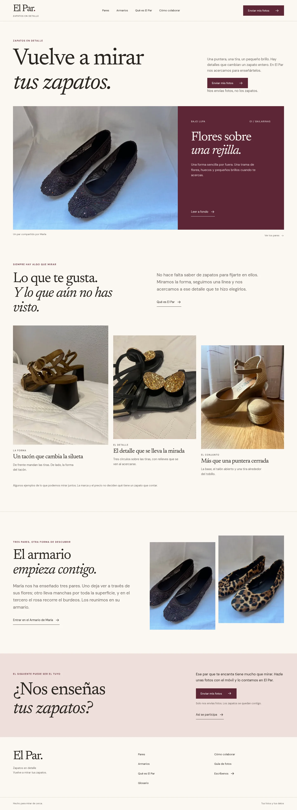
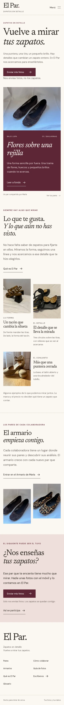
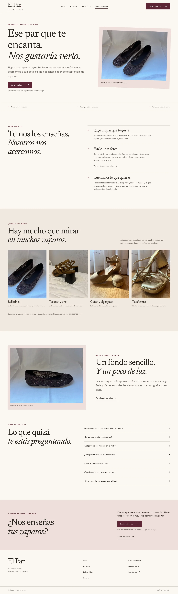
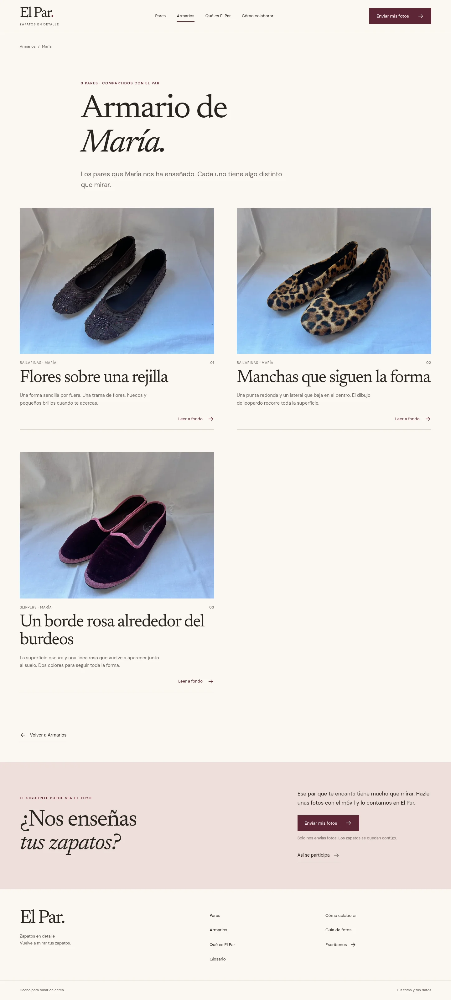
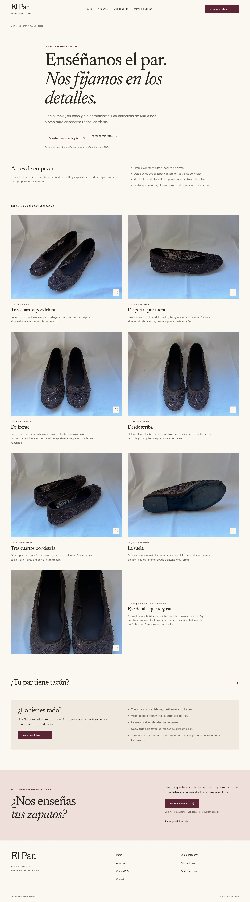
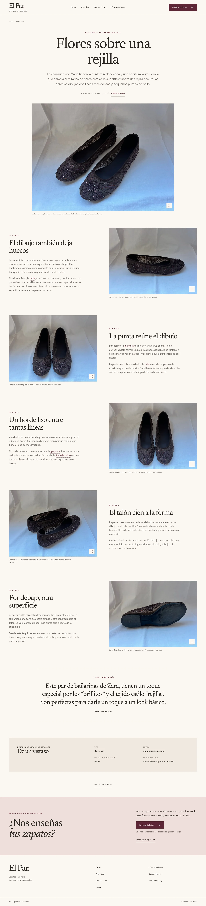

# Revisión de la web

Reconstrucción desde `par-astro`, comprobada el 6 de octubre de 2026. Las capturas corresponden a la compilación con los tres pares de María, sin dominio ni indexación activada.

## Resultado

El camino hasta mandar un par es portada o cualquier página → Cómo colaborar → guía de fotos → Tally. El final de la guía abre el formulario. Quien ya tiene las fotos encuentra arriba, en Cómo colaborar y en la guía, un acceso directo discreto: «¿Ya tienes las fotos? Envíalas directamente». Hay un catálogo de pares, tres análisis, índice de armarios y Armario de María, presentación de El Par, glosario y condiciones de colaboración. Las definiciones también aparecen dentro del análisis y las fotografías pueden ampliarse con teclado.

Se usa la presentación aprobada de Drive, las fotografías autorizadas y citas de las colaboraciones. Los análisis son borradores nuevos basados en las fotos; no se presentan como textos previamente aprobados. El formulario de Tally permanece intacto.

## Inicio en escritorio

## Inicio en móvil

## Cómo colaborar

## Armario de María

## Guía de fotos

## Análisis con bloques MDX

## Verificaciones

- Tipos y compilación de Astro: 0 errores, advertencias o sugerencias.
- 13 documentos HTML: enlaces locales, anclas, identificadores, estructura, imágenes y anchos reales de cada srcset verificados.
- 16 pruebas de navegador: todas las rutas en cinco anchos de 360 a 1440 px, recorrido hasta Tally (final de la guía y acceso directo arriba en Cómo colaborar y en la guía), distinción entre fotos de ejemplo y catálogo, menú por teclado, definiciones, ampliación, guía e impresión desde una visita sin recorrer la página, armarios, recuperación del 404 y lectura sin JavaScript.
- Auditoría automática axe con reglas WCAG 2 A/AA y 2.1 AA en todas las páginas públicas. Superar la auditoría automática no certifica accesibilidad completa; se revisaron además teclado y vistas de móvil y escritorio.
- Formato de código comprobado y dependencias de producción sin vulnerabilidades en la auditoría de npm.
- Servidor de desarrollo comprobado en una copia temporal: al guardar cambios de título y posición de la cita en MDX, la entrada local se actualiza sin editar una plantilla.
- Variables de lanzamiento comprobadas con un dominio de prueba: canónicas, sitemap de 12 rutas, robots e Instagram. Después se restauró la compilación de trabajo sin indexación ni enlace a la cuenta.
- Prueba de crecimiento en una copia temporal con 63 pares: nuevas páginas, incorporación automática al armario existente y creación de otro; exclusión de armarios sin autorización o con un único par; anonimato estable, entradas sin marca/cita y rechazo de referencias inexistentes y rutas duplicadas. También verifica cita movida antes de la foto principal, imagen propia de compartir, exclusión de borradores al lanzar y catálogo vacío.

GitHub Actions repite formato, compilación, verificación y pruebas en cada cambio. Conserva el resultado como artefacto de revisión, sin desplegarlo.

La reorganización del CSS se comparó en 33 vistas (11 rutas a 390, 768 y 1440 px): mismas dimensiones y estilos calculados antes y después. Las reglas responsive están junto a su familia y la entrada de estilos documenta su orden.

## Antes de hacerla pública

Revisar los tres borradores con María; cerrar el alojamiento y formato definitivo de las imágenes; completar los datos legales y elegir dominio/cuenta de despliegue. [Lanzamiento](LANZAMIENTO.md) contiene los pasos y [decisiones de imágenes](IMAGENES-PENDIENTES.md) compara las opciones. Cloudflare Pages sigue siendo adecuado para esta web estática.
