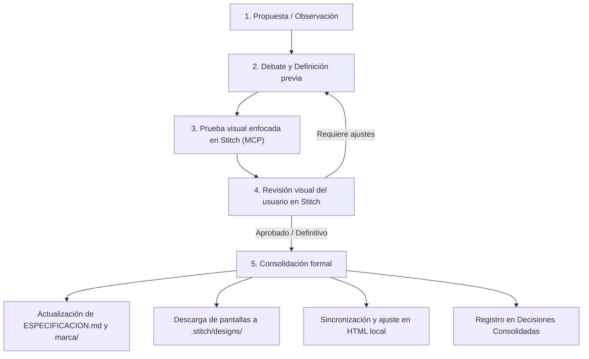

# Registro de Decisiones

Libro de lo **ya resuelto** (aceptado, descartado o pospuesto) y de las preguntas que **bloquean ahora**. No es una lista de trabajo: eso es [TAREAS.md](../TAREAS.md).

---

## 1. Protocolo de Trabajo y Consolidación

Para mantener la coherencia y avanzar con agilidad visual sin contaminar la especificación con pruebas no confirmadas, seguimos este flujo:

> [!IMPORTANT]
> **Regla de consolidación:** Un cambio solo se incorpora a [ESPECIFICACION.md](ESPECIFICACION.md) cuando se ha probado en Stitch, el usuario lo ha validado visualmente y se ha acordado como definitivo. Lo abierto de verdad (una pregunta que hay que cerrar antes de seguir) queda en la sección 3. Lo demás o está cerrado, o está en [TAREAS.md](../TAREAS.md).

---

## 2. Decisiones Aceptadas y Consolidadas

### Identidad Visual y Home
- **Limpieza radical de láminas e imágenes:** Eliminadas las etiquetas superpuestas (`par * 0001`, badges de familia en esquina). La fotografía se presenta limpia sobre paspartú neutro.
- **Pieza destacada (*Hero Piece*) depurada:** Se eliminan los párrafos descriptivos secundarios redundantes. La caja de presentación conserva únicamente los metadatos superiores (`Pieza Destacada` y `Armario de [Nombre]`), el título en serif, el subtítulo taxonómico en una sola línea limpia y el enlace sobrio `Ver estudio →`.
- **Cuadrícula sin ruido de botones:** Se suprimen por completo las frases repetitivas tipo `Leer análisis anatómico →` y los divisores de pie en las tarjetas. Toda la tarjeta o la imagen y el título actúan como enlace interactivo natural. Jerarquía tipográfica y espaciado fluidos y adaptables (sin fijar píxeles en piedra).
- **Tono de archivo sin agresividad comercial:** Suprimido cualquier banner superior o botón tipo venta en cabecera. La invitación a colaborar se aloja serena al final del archivo y con tono de complicidad editorial. Se adopta la fórmula conceptual de *«abrir las puertas del propio armario»* (quedando el copy exacto y los enlaces del footer como borradores de trabajo a afinar en la fase de redacción de marca).
- **Navegación e índices:** Menú sobrio con *Archivo*, *Ver Armarios* y *Sobre El Par* (o *Nuestra Mirada*), descartando *Manifiesto*. Cómo se construyen esas vistas se decide cuando toque hacerlas.
- **Filtro de colecciones:** Botón y selector claro con la etiqueta exacta *«Ver Armarios»*.
- **Sistema de diseño definitivo:** Consolidado y fijado [DESIGN.md](DESIGN.md) como la especificación visual y semántica definitiva del proyecto.
- **Sin piloto paralelo:** la primera entrada real prueba el formato web, la galería, las imágenes junto al texto y el flujo de colaboración. El **lanzamiento en Instagram** (cuándo abrir el perfil, con qué, en qué orden) está pospuesto; no va atado a esa primera pieza.
- **Stack de publicación diferido:** gestor de contenido, modelo de datos, relaciones entre entradas, categorías y buscador, y arquitectura multilingüe se deciden después de esa primera pieza, no antes.
- **Formulario Tally provisional:** el canal actual ([tally.so/r/Npj2bl](https://tally.so/r/Npj2bl)) se sustituye cuando el sitio tenga formulario propio. No es una tarea de ahora.
- **Revisión de la colaboradora:** crédito y citas, no la pieza completa, salvo excepción.
- **Formatos de Instagram (oficio de pieza):** tres formatos en [03](../marca/03-sistema-editorial-y-contenidos.md) (stories de detalle, carrusel de concepto, presentación de par). Eso es cómo se ve un post, no cuándo se lanza el canal.

### Entrada Monográfica y Estructura Editorial
- **Titulación nacida de la mirada honesta:** El título del par revela una observación visual auténtica que la fotografía demuestra (ej. *«Dos extremos, una silueta»*, *«La cintura del tacón»*, *«Una línea sobre el empeine»*), sin forzar paradojas metafóricas artificiales.
- **Subtítulo taxonómico completo:** Acompaña al título con la denominación técnica rigurosa del calzado (familia, escote, tipo de sujeción).
- **Atribución de procedencia limpia:** Identificación sobria como *«Armario de: [Nombre]»*, sin ubicación geográfica accesoria.
- **Foliación editorial de fotos:** Numeración sutil en el margen exterior con punto tipográfico (`· 01`, `· 02`, `· 03`...), suprimiendo cualquier prefijo tipo `fig.` o `lámina`.
- **Flexibilidad de cuadrícula:** Se elimina la proporción rígida 7:5. Se admiten ratios 5:7, 6:6 y 7:5 según la naturaleza de la toma y la extensión del texto, evitando forzar texto de relleno si la explicación es breve. En el prototipo de prueba se dispondrán los tres ratios rotulados al inicio de cada bloque para comparar su ritmo visual.
- **Dípticos fotográficos:** Se permite agrupar dos imágenes en un mismo bloque compartiendo un único texto explicativo común.
- **Notas concisas:** Bloques breves para aclarar singularidades terminológicas no presentes en el léxico general o realizar comparaciones morfológicas rápidas.
- **Anotaciones pedagógicas en imagen (Variante A, para más adelante):** Se descartan las láminas fijas con placas y lupas. El sistema de cotas vectoriales conmutables queda diseñado (el prototipo local puede seguir mostrándolo). **v1 y las primeras publicaciones: foto limpia, sin cotas ni interruptor.** Se aplica en una versión posterior de la web (1.5 o 2).
- **Ficha «Datos del par» como bloque de créditos tipográficos:** Se descarta la tabla de formulario rígida con encabezados por fila. Se adopta una composición continua fluida estilo catálogo de arte o folio de museo, sin iconos ni sobrecarga técnica, jerarquizada por peso tipográfico y filetes de pelo.
- **Popovers anatómicos contextuales:** Subrayado punteado en color cuero `#9E6B55` activo tanto en *hover* (escritorio) como en *click / tap* (móvil y ratón).
- **Cierre contextual:** Mensaje reposado que agradece la cesión (*«Este análisis ha sido posible gracias a [Nombre]...»*) e invita a abrir las puertas del propio armario.
- **Tipologías contrastadas en archivo:** Consolidado el comportamiento editorial tanto para calzado de tacón alto (Salón) como para calzado plano (Bailarina, donde la tensión visual recae en la línea del escote, la ausencia de cambrillón y el collarín de grosgrain con cordón activo).

---

## 3. Abierto (bloquea ahora)

Ninguna pregunta bloquea ahora.

---

## 4. Archivo de Ideas Descartadas o Pospuestas

| Idea | Estado | Motivo y Justificación |
| :--- | :---: | :--- |
| **Lámina técnica de detalle integrado (Variante B con placas/cajas sobre la imagen)** | **Descartada** | Genera sobrecarga visual y ruido estético; convierte el folio editorial en un plano industrial o manual de despiece mecánico con etiquetas fijas ("placa técnica", lupas flotantes) que manchan la imagen. Se consolida en su lugar la Variante A (cotas vectoriales conmutables discretas). |
| **Tarjeta biográfica independiente de la dueña** | **Descartada** | Desviaba el protagonismo del zapato hacia la persona, aproximando la publicación a un blog social o de estilo de vida. El calzado debe sostenerse como objeto de estudio; la aportación de la dueña funciona mejor como filtro de procedencia («Armario de...») y cita testimonial orgánica. |
| **Hover interactivo texto-imagen** | **Pospuesta** | Vincular palabras en el texto a encendidos lumínicos en la imagen añade complejidad técnica y puede entorpecer la lectura pausada. Se opta por una solución más robusta y limpia: botón de control de anotaciones anatómicas directas sobre la foto. |
| **Barra/botón de llamada en la cabecera («Aporta tu par»)** | **Descartada** | Percibido como un elemento comercial agresivo («muy de ventas»). Rompe la serenidad de una monografía editorial. El acceso a colaborar se mantiene discreto en el pie y en cierres de página. |
| **Cuadrícula 7:5 fija e inmutable** | **Descartada** | Generaba monotonía y obligaba a extender artificialmente párrafos explicativos para igualar la altura de las fotografías. Se sustituye por un sistema de retícula flexible (5:7, 6:6, 7:5 y dípticos). |
| **Numeración de catálogo visible (`par * 0001`, `Lámina 03`)** | **Descartada** | Ensucia la fotografía y evoca un manual de despiece industrial o inventario de almacén en lugar de una edición de arte y moda. Las referencias numéricas quedan exclusivamente en el sistema interno de gestión. |
| **Capitulares (Drop Caps) sistemáticas** | **Limitada** | Se descarta su uso automático en todos los bloques. Únicamente se valorará de forma puntual en entradillas de gran extensión para no competir con el título. |
| **Traducción completa al inglés** | **Pospuesta** | El archivo se publica en español; la correspondencia EN vive en el glosario. No bloquea prototipo ni primera pieza. |
| **Categorías exhaustivas y ritmo final de publicación** | **Pospuesta** | Se afinan con un archivo real, no a priori. |
| **Monetización, afiliados o colaboraciones comerciales** | **Pospuesta** | Fuera de alcance mientras se fija el archivo editorial. |
| **Formulario de recepción «definitivo»** | **Pospuesta** | Tally cubre el piloto. El formulario propio espera a la web. |
| **Lanzamiento de Instagram** | **Pospuesta** | Los formatos de pieza están en [03](../marca/03-sistema-editorial-y-contenidos.md). Falta decidir cuándo se abre el perfil, con qué (vacío, una pieza, varias) y en qué orden. No se ejecuta con la primera entrada web. |
| **Cotas / anotaciones sobre la imagen en publicación** | **Pospuesta (v1.5 / v2)** | v1 y primeras piezas: fotografía limpia. El interruptor de cotas (Variante A) se incorpora en una versión posterior de la web. |
